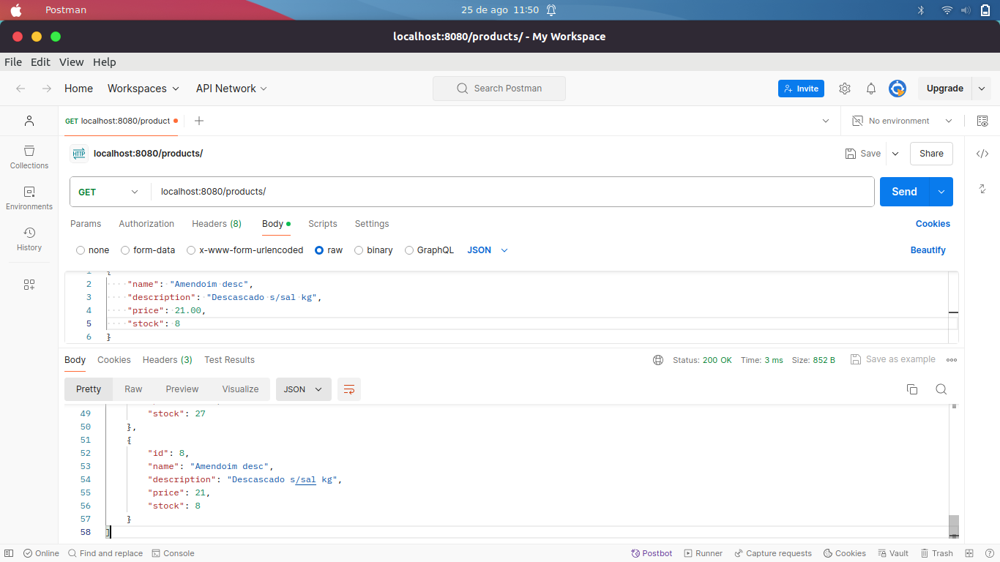
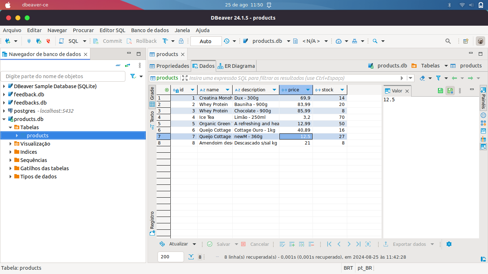

# Natural Products API


## Overview

Natural Products API is a RESTful service built with Go and the Gin framework. It allows you to manage a catalog of natural products, including operations like adding new products, retrieving product information, and more.

## Features

- **Create, Read, Update, Delete** natural products.
- **SQLite database** integration for data persistence.
- **Gin framework** for handling HTTP requests.
- Easily expandable with more features.

## Table of Contents

- [Technologies](#technologies)
- [Getting Started](#getting-started)
- [Endpoints](#endpoints)
- [Database Schema](#database-schema)
- [Examples](#examples)
  - [Postman Screenshots](#postman-screenshots)
  - [DBeaver Screenshots](#dbeaver-screenshots)
- [Gopher Animation](#gopher-animation)

## Technologies

-  - Backend language.
-  - HTTP web framework.
-  - Lightweight relational database.
-  - Database management tool.

## Getting Started

### Prerequisites

- **Go** installed (version 1.20+).
- **SQLite** installed (optional, for direct database access).
- **DBeaver** or another database management tool (optional).

### Installation

1. **Clone the repository:**

   ```bash
   git clone https://github.com/WesleyBSa/natural-products-api.git
   cd natural-products-api
   ```

2. **Install dependencies:**

   ```bash
   go mod tidy
   ```

3. **Run the application:**

   ```bash
   go run cmd/main.go
   ```

4. The API will be available at `http://localhost:8080`.

## Endpoints

Here are the main endpoints of the API:

- **GET** `/products/` - Retrieve all products.
- **POST** `/products/` - Add a new product.
- **PUT** `/products/:id` - Update an existing product.
- **DELETE** `/products/:id` - Delete a product.

## Database Schema

The API uses the following database schema for products:

| Column      | Type    | Description            |
|-------------|---------|------------------------|
| `ID`        | uint    | Primary key            |
| `Name`      | string  | Name of the product    |
| `Description` | string  | Short description of the product |
| `Price`     | float64 | Price of the product   |
| `Stock`     | int     | Available stock quantity |

## Examples

### Postman Screenshots



### DBeaver Screenshots



## License

This project is licensed under the MIT License - see the [LICENSE](LICENSE) file for details.

## Acknowledgements

- Inspired by the official Go documentation and various community projects.
